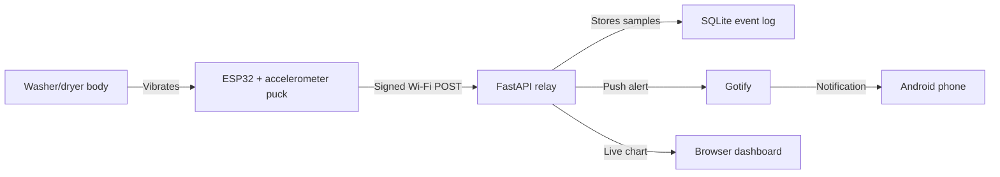

# Laundry Done

An ESP32 laundry-finished detector for apartment washer/dryer stacks. The device
sticks to the outside of the machine, watches vibration with an accelerometer,
and sends a phone notification when the washer, dryer, or whole stack has been
quiet long enough to count as done.

The project is designed to be approachable:

- No appliance disassembly.
- No mains wiring.
- Battery-bank friendly.
- One small sensor puck on the outside of the washer/dryer.
- A Docker relay that can run on a home server.
- A warm-up worker that keeps the private mobile-facing routes exercised.
- A live calibration dashboard for seeing the vibration data.

## What You Build



## How It Works

The accelerometer samples motion for a short window and reports two plain-English
numbers:

- `Vibration strength`: the typical shake during the sample window.
- `Biggest jolt`: the largest instant change during that same window.

The ESP32 signs each event with an HMAC secret before sending it to the relay.
The relay rejects unsigned traffic, stores calibration samples locally, and asks
Gotify to notify your phone for finished-cycle events.

The current production firmware uses a 10-second cadence for the first 10
minutes after boot, then drops to a 30-second idle heartbeat with Wi-Fi off
between posts when the machine is quiet. Long idle waits use light sleep but
wake every 15 seconds for a 2.5-second Wi-Fi-radio keep-alive pulse. It returns
to a 10-second cadence during motion and the done-confirmation quiet window,
and active cycles run an 8-second Wi-Fi scan/radio load pulse every 25 seconds
to stay below the measured sub-40-second HyperGear no-load cutoff. It uses NTP
timestamps when Wi-Fi is available, and keeps the onboard LED off except while
transmitting or pulsing the power-bank keepalive.

## Documentation Map

- [Instructable draft](docs/instructable.md): copy-paste friendly article text.
- [Build guide](docs/build-guide.md): bench wiring, flashing, relay setup, and
  calibration.
- [HTTPS access](docs/https-access.md): optional Tailscale Serve setup for a
  trusted HTTPS dashboard URL.
- [Parts guide](docs/parts-guide.md): Amazon-friendly search terms and buying
  notes.
- [Architecture diagrams](docs/architecture.md): Mermaid diagrams for GitHub,
  Instructables, or Figma.
- [GitHub publishing notes](docs/github-publish.md): repo description and topics.

## Quick Start

1. Order a supported I2C accelerometer and build supplies from
   [docs/parts-guide.md](docs/parts-guide.md).
2. Wire the accelerometer to the ESP32 on the bench using
   [docs/build-guide.md](docs/build-guide.md).
3. Copy `.env.example` to `.env` on your home server and edit the secrets.
4. Start the relay, Gotify, and the warm-up worker:

   ```bash
   docker compose up -d --build
   ```

5. Copy `firmware/include/laundry_config.h.example` to
   `firmware/include/laundry_config.h`, set Wi-Fi and relay values, then upload:

   ```bash
   pio run -e esp32dev -t upload
   ```

6. Open the dashboard:

   ```text
   http://<home-server-lan-ip>:8088/monitor
   ```

7. Optional: expose the dashboard privately over trusted HTTPS with
   [Tailscale Serve](docs/https-access.md).
8. Mount the puck on the washer/dryer, start a load, and watch the live chart.

## Repo Layout

```text
.
├── compose.yaml                 # Relay + Gotify Docker Compose stack
├── docs/                        # Build, parts, diagrams, instructable draft
├── firmware/                    # PlatformIO ESP32 firmware
├── server/                      # FastAPI relay and pytest tests
└── README.md
```

## Development

Run the server tests:

```bash
conda run -n data python -m pytest server/tests -q
```

Run the firmware logic tests:

```bash
platformio test -e native
```

Build the ESP32 firmware:

```bash
platformio run -e esp32dev
```

Bench-test an attached accelerometer by mapping motion to the onboard LED:

```bash
platformio run -e accel_led_test -t upload --upload-port /dev/cu.usbserial-8
platformio device monitor --port /dev/cu.usbserial-8 --baud 115200
```

## Safety

Do not open the appliance, modify dryer wiring, or touch the 240V/220V outlet.
This project only observes vibration from the outside and powers the ESP32 from
a USB power bank. Keep cables away from the door, drum, hinge, dryer exhaust,
and any hot or moving parts.

## References

- [Adafruit LSM6DS guide](https://learn.adafruit.com/lsm6ds3tr-c-6-dof-accel-gyro-imu)
- [Adafruit LIS3DH guide](https://learn.adafruit.com/adafruit-lis3dh-triple-axis-accelerometer-breakout)
- [Espressif Arduino ESP32 sleep API](https://docs.espressif.com/projects/arduino-esp32/en/latest/api/deepsleep.html)
- [Gotify install docs](https://gotify.net/docs/install)
- [Gotify push message API](https://gotify.net/docs/pushmsg)
