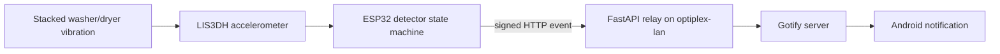

# Laundry Done

An ESP32 + accelerometer laundry notifier for a stacked apartment washer/dryer.
The device sticks to the shared appliance body, watches for vibration, and sends
a Gotify phone alert when the washer, dryer, or whole stack has been quiet long
enough to be considered done.

This is designed as an instructable-style project: cheap parts, no appliance
disassembly, no mains wiring, and a small Docker relay that can run on a home
server.

## What It Does

- Detects laundry motion with an LIS3DH accelerometer.
- Runs the washer/dryer decision locally on the ESP32.
- Sends only finished-cycle events over Wi-Fi.
- Relays events through a FastAPI service on `optiplex-lan`.
- Pushes Android notifications with Gotify.
- Handles the normal sequential flow: washer first, dryer second.
- Falls back to a generic `Laundry stack stopped` alert for ambiguous tandem
  washer/dryer motion.



## Repo Layout

- `firmware/` - PlatformIO Arduino firmware and unit-tested detector logic.
- `server/` - FastAPI relay, Dockerfile, and pytest tests.
- `compose.yaml` - Relay + Gotify compose stack for the home server.
- `docs/parts-guide.md` - Amazon-oriented order guide.
- `docs/build-guide.md` - Hardware, firmware, server, and calibration steps.

## Quick Start

1. Order the accelerometer and small build supplies from
   [docs/parts-guide.md](docs/parts-guide.md).
2. Build the small sensor puck using [docs/build-guide.md](docs/build-guide.md).
3. Copy `.env.example` to `.env` on `optiplex-lan` and edit the secrets.
4. Start the relay and Gotify:

   ```bash
   docker compose up -d --build
   ```

   Gotify Android login uses username `admin`. The password is
   `GOTIFY_DEFAULTUSER_PASS` from the server-side `.env` file.

5. Copy `firmware/include/laundry_config.h.example` to
   `firmware/include/laundry_config.h`, set Wi-Fi and relay values, then upload:

   ```bash
   pio run -e esp32dev -t upload
   ```

6. Run one washer cycle and one dryer cycle while watching serial logs. Adjust
   thresholds only if the defaults misclassify your actual machine.

## Development

Run the host-side tests:

```bash
pio test -e native
pytest tests -q
```

From the repo root, use `pytest` like this:

```bash
cd server
pytest tests -q
```

Build the ESP32 firmware:

```bash
pio run -e esp32dev
```

## Safety

Do not open the appliance, modify dryer wiring, or touch the 240V/220V outlet.
This project only observes vibration from the outside and powers the ESP32 from
a USB power bank. Keep cables away from the door, drum, hinge, dryer exhaust,
and any hot or moving parts.

## References

- [Adafruit LIS3DH guide](https://learn.adafruit.com/adafruit-lis3dh-triple-axis-accelerometer-breakout)
- [Espressif Arduino ESP32 sleep API](https://docs.espressif.com/projects/arduino-esp32/en/latest/api/deepsleep.html)
- [Gotify install docs](https://gotify.net/docs/install)
- [Gotify push message API](https://gotify.net/docs/pushmsg)
