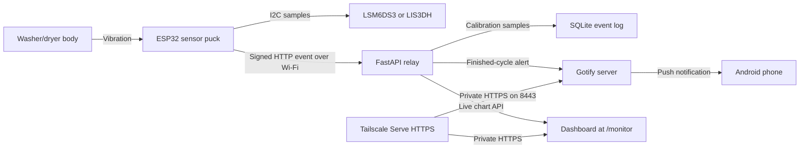
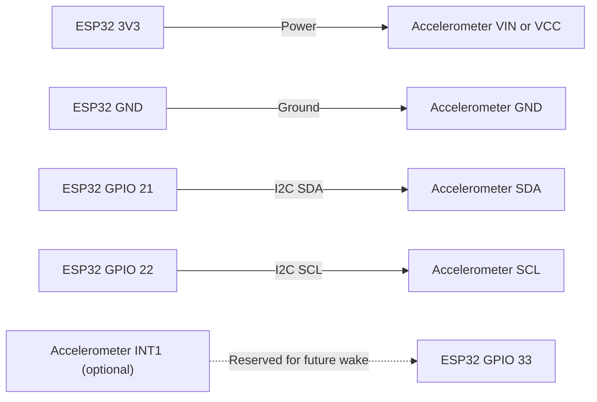
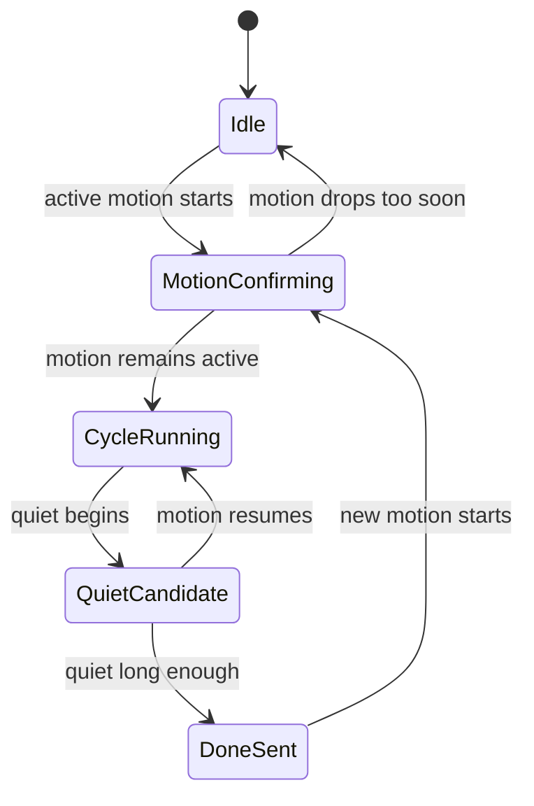
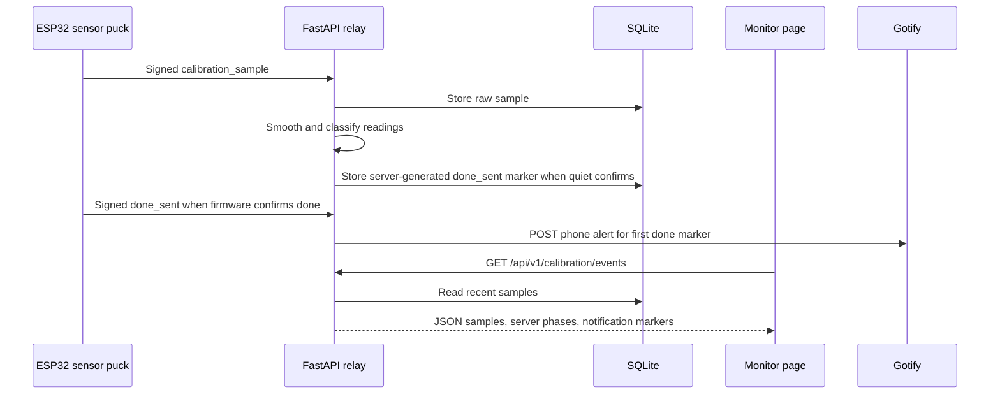

# Architecture Diagrams

These diagrams are intentionally Mermaid-first so they render on GitHub and can
be copied into Instructables, FigJam, Excalidraw, or a blog post.

## System Overview

## Wiring

## Firmware State Machine

## Telemetry And Dashboard Flow

## Dashboard Terms

| Dashboard label | Meaning |
| --- | --- |
| Vibration strength | RMS motion in `mg`, or the typical shake during the sample window. |
| Biggest jolt | Peak motion in `mg`, or the largest instant change in that window. |
| Phase background | Server-side best guess for that time span: quiet, washer, dryer, or strong spin. |
| Sensor sample | Time reported by the ESP32 when it took the measurement. |
| Relay received | Time the home server received the measurement. |
| Wi-Fi signal | ESP32 Wi-Fi RSSI in dBm; less negative is stronger. |

## Why A Relay Exists

The ESP32 could send notifications directly to a cloud service, but the relay
keeps the embedded firmware simple and private:

- The ESP32 only knows the home Wi-Fi, relay URL, and device secret.
- The relay owns Gotify credentials.
- Calibration data stays in a local SQLite database.
- The phone can read the same relay dashboard for tuning.
- Gotify can be kept LAN-only, Tailscale-only, or exposed through a controlled
  tunnel later.
