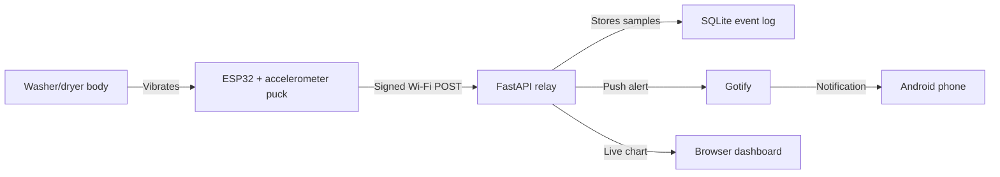

# Instructable Draft: ESP32 Laundry Done Detector

This is copy-paste friendly draft text for an Instructables post, project blog,
or portfolio write-up. Replace bracketed photo notes with real photos from your
build.

## Title

ESP32 Laundry Done Detector For A Stacked Apartment Washer/Dryer

## One-Sentence Summary

Build a small battery-powered ESP32 sensor puck that sticks to the outside of a
washer/dryer, watches vibration, and sends your phone a notification when the
laundry is done.

## Why I Built This

My apartment washer/dryer is tucked away in a closet, far enough from my desk
that I cannot hear the machine finish. That means wet laundry can sit too long
before I remember to move it into the dryer.

I wanted a solution that felt practical but still a little whimsical: a small
Arduino/ESP32 puck, stuck to the outside of the washer, powered by a USB battery
bank, and clever enough to notice when the machine stops moving.

The important constraint: no appliance disassembly and absolutely no messing
with the dryer outlet. This project only senses vibration from the outside.

## What It Does

- Watches washer/dryer vibration with an accelerometer.
- Sends signed Wi-Fi events to a small home-server relay.
- Stores recent calibration samples in SQLite.
- Shows a live dashboard with a time-series graph.
- Sends Android phone alerts through Gotify.
- Handles the normal flow of washer first, then dryer.

## Safety Note

Do not open the appliance, modify wiring, or touch the 240V/220V dryer outlet.
This project runs from USB power and senses motion from the outside of the
appliance cabinet.

Keep the enclosure, USB cable, and battery bank away from:

- Door hinges.
- The washer lid or dryer door path.
- Dryer exhaust.
- Hot surfaces.
- Anything that moves, pinches, or rubs.

## Materials

Required:

- ESP32 DevKit board.
- LSM6DS3 accelerometer breakout, or LIS3DH accelerometer breakout.
- Female-to-female jumper wires for bench testing.
- Short USB cable.
- USB battery bank.
- Small plastic project box.
- Tape, 3M Dual Lock, magnets, or a strap to hold the box flat to the appliance.

Nice to have:

- Heat-shrink tubing.
- Hot glue for strain relief.
- Soldering iron and solder.
- Small zip ties.
- Label maker or masking tape.

See [parts-guide.md](parts-guide.md) for Amazon search terms.

## Tools

- Computer with PlatformIO installed.
- Home server, NAS, mini PC, or always-on computer that can run Docker Compose.
- Android phone with the Gotify app.
- Multimeter, optional but useful for sanity checks.

## System Diagram



## Step 1: Wire The Accelerometer On The Bench

Start on the bench before installing anything on the machine.

| Accelerometer | ESP32 DevKit |
| --- | --- |
| `VIN`, `VCC`, or `3V` | `3V3` |
| `GND` | `GND` |
| `SDA` | GPIO `21` |
| `SCL` | GPIO `22` |
| `INT1`, optional | GPIO `33` reserved for future wake work |

[Photo: ESP32 and accelerometer connected with jumper wires.]

## Step 2: Confirm The ESP32 Can See The Sensor

Upload the I2C scanner:

```bash
platformio run -e i2c_scan -t upload --upload-port /dev/cu.usbserial-8
platformio device monitor --port /dev/cu.usbserial-8 --baud 115200
```

The LSM6DS3 board used in this build normally appears at `0x6B`.

Then upload the LED motion test:

```bash
platformio run -e accel_led_test -t upload --upload-port /dev/cu.usbserial-8
platformio device monitor --port /dev/cu.usbserial-8 --baud 115200
```

If the sensor is working, the onboard LED should get brighter when you tap or
wiggle the board.

[Photo: serial monitor showing detected sensor type.]

## Step 3: Set Up The Home Relay

The relay receives signed events from the ESP32 and forwards finished-cycle
alerts to Gotify.

On your home server:

```bash
cp .env.example .env
```

Edit `.env`:

```text
DEVICE_SECRET=replace-with-a-long-random-secret
GOTIFY_URL=http://gotify:80
GOTIFY_APP_TOKEN=replace-with-gotify-application-token
GOTIFY_DEFAULTUSER_PASS=replace-with-a-long-random-admin-password
```

Start the services:

```bash
docker compose up -d --build
```

Open Gotify:

```text
http://<home-server-lan-ip>:8089
```

Log in with:

- Username: `admin`
- Password: the `GOTIFY_DEFAULTUSER_PASS` value from `.env`

Create a Gotify application token, paste it into `.env`, and restart the relay:

```bash
docker compose restart relay
```

Check the relay:

```bash
curl http://<home-server-lan-ip>:8088/healthz
```

Expected response:

```json
{"ok":true}
```

## Step 4: Configure The ESP32 Firmware

Copy the firmware config template:

```bash
cp firmware/include/laundry_config.h.example firmware/include/laundry_config.h
```

Edit these values:

```cpp
#define WIFI_SSID "your-wifi"
#define WIFI_PASSWORD "your-password"
#define RELAY_URL "http://<home-server-lan-ip>:8088/api/v1/events"
#define DEVICE_SECRET "same-secret-as-dot-env"
```

Upload production firmware:

```bash
platformio run -e esp32dev -t upload --upload-port /dev/cu.usbserial-8
platformio device monitor --port /dev/cu.usbserial-8 --baud 115200
```

## Step 5: Open The Live Dashboard

Open:

```text
https://laundry.robertboscacci.com/monitor
```

This URL is still private: the DNS record points at the home server's Tailscale
address, so your phone/laptop must be connected to the tailnet. The ESP32 can
keep posting to the local LAN URL; browsers get HTTPS through Caddy and
Tailscale:

```bash
docker compose up -d --build caddy
tailscale funnel --https=443 off
tailscale serve --bg --yes --tcp=443 tcp://127.0.0.1:8444
```

The chart shows:

- Vibration strength: typical shake.
- Biggest jolt: largest instant movement.
- Phase backgrounds: the dashboard's best guess for that time span.
- Bottom time axis: human-readable time of day.

`mg` means milli-g, or thousandths of Earth gravity. A value of `300 mg` is
`0.3 g`. The dashboard hides jolts above `300 mg` because those are usually
handling bumps from touching the box, not useful washer/dryer rhythm.

[Screenshot: dashboard showing a washer or dryer run.]

## Step 6: Build The Enclosure

After the bench tests pass:

1. Solder the four required accelerometer wires.
2. Add heat-shrink or hot glue for strain relief.
3. Place the ESP32 and accelerometer inside the project box.
4. Keep the accelerometer flat against the wall of the box that touches the
   appliance.
5. Leave access to the USB port.

[Photo: sensor puck open, showing ESP32 and accelerometer.]

## Step 7: Mount It On The Washer/Dryer

Good mounting spots:

- Flat front or side panel.
- Near the seam between washer and dryer on a stacked unit.
- Close enough to the battery bank for a short cable.
- Away from doors, hinges, exhaust, and hot surfaces.

Avoid dangling the sensor from a hook. A swinging enclosure creates false
motion. The box should be pressed flat against the appliance body.

[Photo: mounted puck and battery bank.]

## Step 8: Run A Real Load And Calibrate

Start with a heavy load, like bedding, because it gives a clear signal.

Watch the dashboard while the washer runs. You should see:

- Active vibration while the machine agitates or spins.
- Quiet or near-quiet regions during fill/soak.
- A long quiet period after the cycle is finished.

Then run the dryer. In a normal washer-then-dryer flow, the dashboard can use
the quiet handoff between cycles to label the second active period as dryer
motion.

The defaults are intentionally conservative:

- Active: `3 mg`
- Active peak: `8 mg`
- Quiet: `1.5 mg`
- Washer spin peak: `120 mg`
- Done quiet period: `10 minutes`

## Step 9: Use It

For the current battery-bank-friendly setup:

1. Press the battery bank power button when starting laundry.
2. Start the washer or dryer.
3. Let the ESP32 send samples and finished-cycle events. It checks in every 10
   seconds for the first 10 minutes, then uses a 30-second idle heartbeat with
   Wi-Fi off between posts. During that idle heartbeat, it wakes every 15
   seconds for a 2.5-second Wi-Fi-radio keep-alive pulse so the USB battery bank
   does not auto-off. It returns to 10-second samples when it sees motion, and
   active cycles run an 8-second Wi-Fi scan/radio load pulse every 25 seconds to
   stay below the measured sub-40-second HyperGear no-load cutoff.
4. Move laundry when Gotify notifies your phone.

The firmware keeps the onboard LED off except for a very short transmit blink.

## Troubleshooting

### The ESP32 Does Not Join Wi-Fi

- Make sure the SSID and password are correct.
- The ESP32 only uses 2.4 GHz Wi-Fi.
- If your router uses one shared 2.4/5 GHz network name, keep 2.4 GHz enabled.
- Move the board closer to the access point for the first test.

### The Dashboard Is Empty

- Confirm the relay health endpoint returns `{"ok":true}`.
- Make sure the dashboard secret matches `DEVICE_SECRET`.
- Check that the firmware is posting `calibration_sample` events.
- Verify the ESP32 serial monitor says Wi-Fi is connected.

### It Alerts Too Early

- Mount the puck more firmly.
- Raise active thresholds slightly.
- Avoid mounting on a door, hook, or loose panel.

### It Never Alerts

- Check the dashboard after the machine stops.
- If the stopped machine still shows vibration, raise the quiet threshold
  carefully.
- Make sure the battery bank stays awake long enough for the ESP32 to transmit.

### The Chart Has Huge Spikes

Those are probably handling noise from moving or touching the sensor. The
dashboard hides peaks above `300 mg` by default.

## What I Would Improve Next

- Add a 3D-printable enclosure.
- Add a hardware interrupt wake circuit for deeper sleep.
- Make the dashboard classifier configurable from the UI.
- Add Home Assistant or MQTT support.
- Add an iOS-friendly notification path.

## GitHub Repo Description

ESP32 vibration detector for washer/dryer finish notifications, with a
Dockerized Gotify relay and live calibration dashboard.
